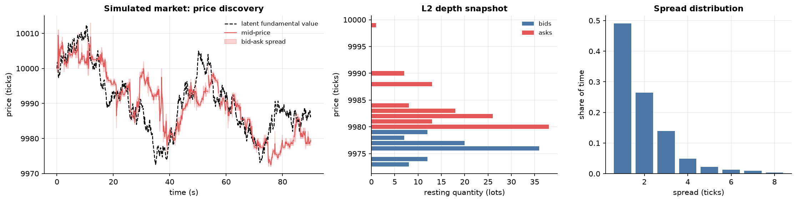
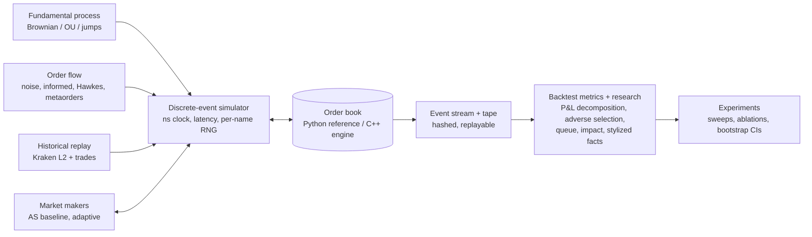
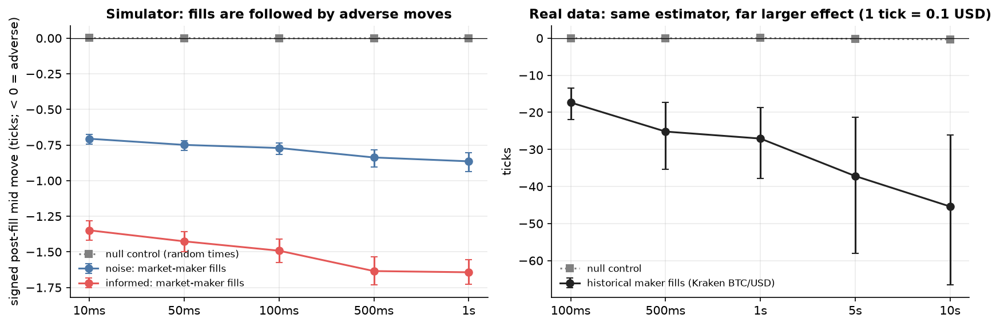
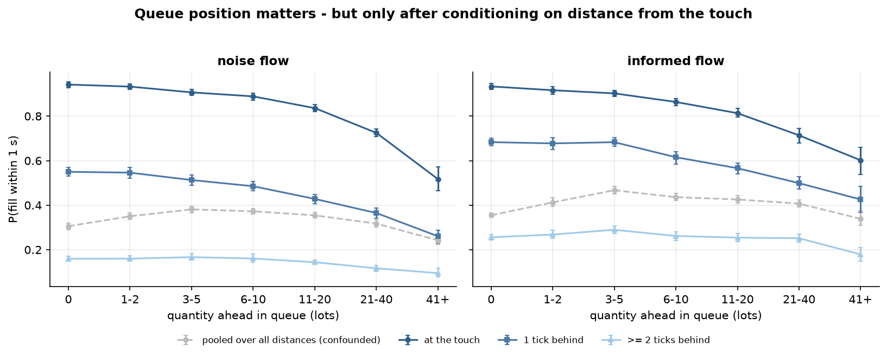
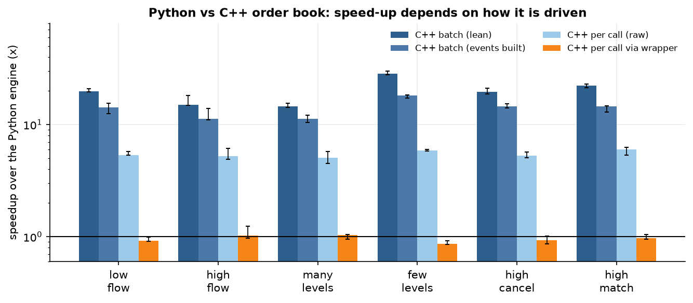
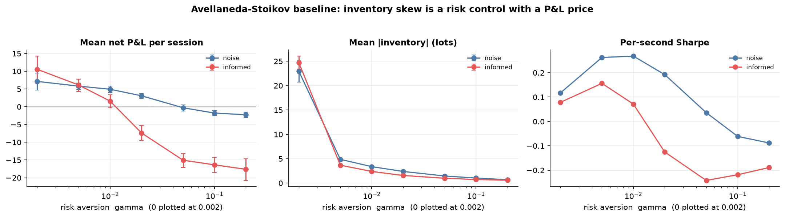
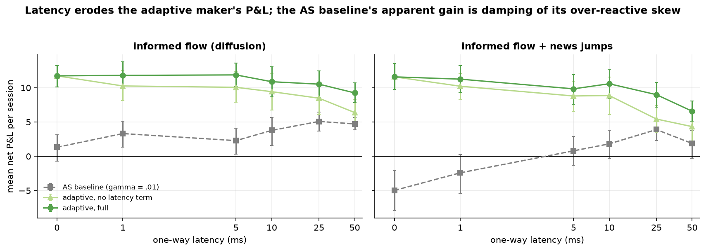
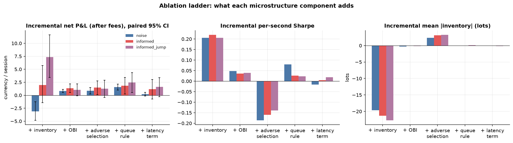
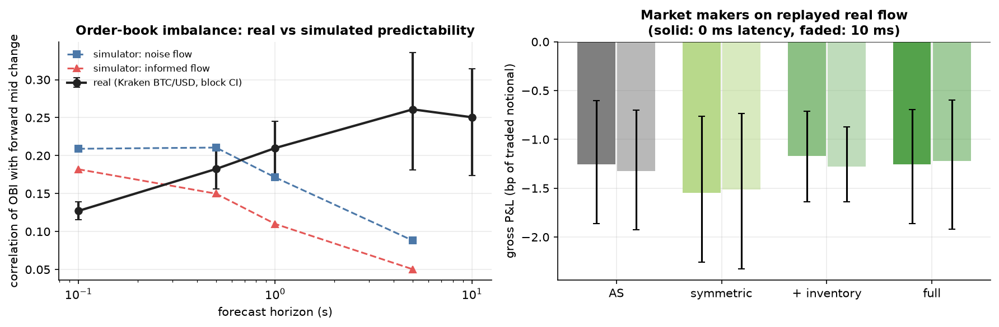

# lob-market-maker

A research framework for studying **limit-order markets and market making**: a price-time-priority order book (Python reference + C++ port,
differentially tested), a discrete-event simulator, synthetic and *replayed real* order flow, two market-making strategies, and a set of controlled
experiments with uncertainty quantification. It is a quantitative-research portfolio project, **not a trading system and not a claim that any strategy
makes money**; the aim is a rigorous experimental environment for asking what a market maker's decisions are worth under stated assumptions.

Everything is reproducible from the command line and every result records its seed, parameters, dataset, git commit and environment.

```bash
pip install -e ".[dev]"                     # + ".[data]" only to record a live feed
scripts/build_cpp.sh                        # optional: C++ engine + pybind11 extension + C++ tests
pytest                                      # ~350 Python tests (C++ differential tests skip if the extension is not built)
python -m experiments.run --list            # every experiment
python -m experiments.run inventory --seed 42 --workers 8
```

**How to read this document.** Claims are kept in four layers and never mixed: *theoretical assumptions* (what a model postulates) ->
*simulation assumptions* (what the simulator hard-codes) -> *empirical observations* (what was measured, with intervals) -> *research conclusions*
(what those measurements do and do not support). Results marked "simulator" describe the simulator, not real markets; the real-data section says what
was measured on one recorded hour of one instrument.

## At a glance


*A 90 s simulated session (noise + informed flow, seed 7; `scripts/make_readme_figures.py`): the mid tracks the latent fundamental, the book shows resting depth on both sides, and the spread is 1-3 ticks ~90% of the time.*



The figures below are regenerated from the committed `results/` CSVs by `python scripts/make_readme_figures.py`; each sits next to the section that explains the method.

---------------------------------------------------------------------------------------------------

## 1. Motivation

Market-making papers (Avellaneda-Stoikov and successors) derive quotes under clean assumptions; whether those assumptions hold, and which extra
information (order-book imbalance, queue position, own adverse selection, latency) is worth using *after costs*, are empirical questions that need a
controlled environment: a faithful matching engine, exogenous order flow with known properties, exact accounting, many independent sessions, paired
comparisons. This repository builds that environment and uses it to test the theory's assumptions, measure microstructure effects directly, run ablations
and latency studies, and compare simulated with recorded real order flow.

## 2. Market-microstructure background (what is used)

A limit-order book holds resting buy (bid) and sell (ask) orders. A *marketable* order executes immediately against the best opposite prices; a
resting order waits its turn (**price priority, then time priority**). A market maker quotes both sides to earn the spread but faces **inventory risk** (the position it
accumulates) and **adverse selection** (being filled by better-informed traders, after which the price moves against it). Standard effects studied here: the spread and
depth dynamics, **order-book imbalance** `OBI = (V_b - V_a)/(V_b + V_a)` as a short-horizon predictor, **queue position** as a determinant of fill probability,
**price impact** of aggressive orders, and the role of **latency** (stale quotes are picked off).

## 3. Order-book architecture

```
Price -> PriceLevel -> FIFO of orders            (intrusive doubly linked list)
Order ID -> order node                           (O(1) cancel / modify / queue-position)
```
Prices are integer ticks, quantities integer lots, time integer nanoseconds. Supported: limit (GTC / IOC / post-only), market, cancel, cancel-replace,
partial and full fills, L2 depth and L3 order-level state, crossed-book prevention, best bid/ask, mid, spread. Order ids are unique for the book's lifetime.
Python reference: `engine/python/`; C++ port: `engine/cpp/`; wrapper with the same API: `engine/cpp_engine.py`.

**Events.** Every state transition emits a structured, serialisable event (`ADD`, `TRADE`, `CANCEL`, `MODIFY`, `EXPIRE`, `REJECT`, `SNAPSHOT`); events are state
*deltas*, so applying them to an empty book reproduces it (`OrderBook.apply_event`, which also verifies every pre-state condition an event asserts). Streams are canonical JSONL
with a SHA-256 stream hash; the same commands always give a byte-identical stream.

## 4. Matching algorithm

A marketable order walks the opposite side from the best price inwards; inside a level it consumes the FIFO from the head; each execution is at the **resting** (maker) price, so
price improvement goes to the taker. Limit remainders rest at the back of their level. Cancel-replace: a same-price size decrease keeps queue priority; a price change or size
increase requeues the order at the back; a marketable replace executes as `CANCEL(REPLACE)` plus a fresh aggressive arrival. No self-trade prevention.

## 5. Data structures and complexity (`P` = active price levels, `k` = orders consumed)

| operation | target | Python | C++ |
|---|---|---|---|
| add (rest) | O(log P) | bisect search + O(P) memmove (measurable only beyond ~10^4 levels) | `std::map`, O(log P) |
| cancel by id | O(1) after lookup | dict lookup + linked-list unlink | hash lookup + unlink |
| match | O(k) | linear in k | linear in k |

Checked empirically (`benchmark_complexity`): match is linear in both (log-log slope 0.96 / 0.91); cancel is flat in Python (slope 0.03); C++ cancel time rises from 0.04 to 0.28 us as the
book grows to 400k orders (attributed to cache misses, not measured with counters); Python add cost is 5x higher at 10^5 than at 10^4 levels.

## 6. Event-driven simulation

`simulator/`: an integer-nanosecond clock and a future-event queue (FIFO tie-break) around the *true* exchange book. Participants (synthetic flow, historical replay, strategies) share one
interface; commands reach the exchange after the sender's **order latency**, public events reach a subscriber after its **feed latency** (a strategy keeps a delayed *replica* book by
applying events, so stale quotes emerge naturally). Every stochastic component draws from its own RNG stream keyed by `(seed, name)`, so adding a participant never perturbs the
others' random numbers (crucial for paired comparisons). Runs record periodic market-state samples, the trade tape (with pre-trade mid, taker and maker ids), the full event log and the command log.

## 7. Synthetic order flow

Noise traders (Poisson arrivals; per-order exponential cancel lifetimes; configurable size/offset distributions: exponential, log-normal, Pareto); informed / momentum traders acting on a latent
fundamental (Brownian or Ornstein-Uhlenbeck, optionally with news jumps) plus imbalance and momentum signals; Hawkes (self-exciting) arrivals; order-splitting metaorder traders.
**None of the distributions is assumed realistic**: `experiments.validation.stylized_facts` and the real-data comparison measure how they differ from real markets.

## 8. Market-making models

*Baseline* - Avellaneda-Stoikov (`strategies/baseline_mm.py`): reservation price `r = m - q gamma sigma^2 (T - t)`, total spread `gamma sigma^2 (T-t) + (2/gamma) ln(1 + gamma/k)`. The module states the
assumptions (Brownian mid, exponential fill intensity, CARA utility, no latency/queue/fees), the derivation sketch (the closed form is a second-order approximation), and every implementation
choice that is *not* theory (volatility estimate, horizon handling, rounding, safety guards).

*Adaptive* (`strategies/adaptive_mm.py`): every adjustment is an explicit function of one measured state variable and has its own switch - inventory skew `m - lambda I` and inventory-dependent size,
OBI shift, per-side adverse-selection widening (own measured post-fill cost), latency widening `sigma sqrt(L)` (L measured from own order acknowledgements), and an expected-value queue rule that keeps a
resting quote unless moving is worth more. Coefficients are theory-motivated or *measured on disjoint seeds*, not tuned. With every switch off it quotes symmetrically at `mid +- 1/k`.

Both share `strategies/base.py`: delayed replica book, own-fill bookkeeping, post-only requoting that preserves queue priority, soft inventory limit, hard inventory/drawdown **kill-switch**
(cancel, flatten, stop), fees, and safety guards (volatility bounds, quote-offset cap) that are documented as engineering, not theory.

## 9. Adverse-selection methodology

Measured *directly* (no VPIN-style proxy) on exchange ground truth. For a passive fill of side `s` (+1 bought), price `p`, pre-trade mid `m^-`: effective half-spread `E = s(m^- - p)`, signed post-fill
move `M_h = s(m_{t+h} - m^-)` (negative = adverse) at 10 ms - 1 s (and longer on real data), realised half-spread `R_h = E + M_h`. A **null control** (same statistic at random times / random sides) must be ~0 for
fill-conditioned values to be attributable to the fills. Breakdowns: by taker type (known in the simulator), by inventory effect, by imbalance at the fill. (`research/adverse_selection.py`)


*Signed post-fill mid move after passive fills (mean with 95% CI). The grey null control (random times) is ~0, so the drift is attributable to the fills. Left: simulator, larger against informed takers. Right: the same estimator on the recorded Kraken hour (note the units are 0.1 USD ticks, so the magnitudes are not comparable across panels).*

## 10. Queue-position methodology

A probe posts 1-lot post-only orders at and behind the touch and reads its exact quantity-ahead `Q_t` from the book every 250 ms together with spread, depth, volatility, flow and signed imbalance; the outcome is
"filled within dt". Only fully observed windows are used (no censoring bias). Estimators: empirical `P(fill | Q)` by bin and a logistic model, evaluated out of sample (AUC), with session-level bootstrap. Lesson recorded
in the analysis: stratify by the *current* distance from the touch, not the distance at posting, or `Q` looks uninformative. (`research/queue_position.py`)


*P(fill within 1 s) versus quantity ahead, by distance from the touch (95% CIs). The grey pooled curve is non-monotone because distance confounds it; stratified curves fall with queue-ahead.*

## 11. Backtesting methodology

Session metrics are computed from **exchange ground truth** (trade tape + event log + true mid), not from a strategy's own beliefs (which lag under latency): realised (average-cost), mark-to-market, edge (spread capture
vs pre-trade mid) and inventory P&L (an exact identity, tested against its integral form), fees applied from exact traded notional, Sharpe (per second; annualised values are extrapolations and are not quoted), maximum drawdown, tail
losses, inventory distribution, fill rate, quote lifetime/survival, quote-to-trade and cancellation rates, adverse-selection cost. Sessions are independent seeds; every arm of an experiment uses the *same* seeds (common random numbers).

## 12. Statistical methodology

Session is the unit of inference (samples inside a session overlap). Reported per metric: mean, median, standard deviation, bootstrap CI. Comparisons are **paired** differences with bootstrap CIs, p-values and effect sizes; multiplicity is controlled
(Holm) only for the declared primary family of each experiment, everything else is flagged exploratory. On real data (one recording) uncertainty comes from block bootstrapping, which is optimistic. (`backtest/statistics.py`)

## 13. Validation experiments (simulator versus known properties)

Stylized-fact estimators (heavy tails via Hill, volatility clustering, order-sign long memory, arrival clustering, spread), price impact, and book resilience after controlled shocks, each validated against processes with a known answer
before use (`research/stylized_facts.py`, `research/resilience.py`). These are reported separately from strategy results.

## 14. Python versus C++ benchmark (Apple M4, clang, `-O3`; 200k commands/workload, identical event streams verified first)

| how the C++ is driven | speedup over the Python engine (6 workloads) |
|---|---|
| batch, events not built | 14x - 29x |
| batch, events materialised (like-for-like) | 11x - 18x |
| one binding call per command (raw tuples) | 5x - 6x |
| one call per command through the drop-in wrapper (builds `Event` objects) | **0.9x - 1.0x** |

C++ per-command latency is under ~0.2 us (clock resolution ~42 ns) versus 1.5 - 6.5 us in Python; memory per resting order is ~15% lower. The honest conclusion: the C++ core is much faster, but from Python that only materialises with
coarse-grained calls; the simulator's per-command loop gains parity, not speed. (`docs/stage6_cpp_engine_findings.md`)


*Speedup of the C++ engine over the Python engine by driving mode (log scale). The last bars, one call per command through the drop-in wrapper, sit at ~1x.*

## 15. Results

Full write-ups with hypotheses, methods, intervals and limitations are in `docs/`. Headlines (all *simulator* results unless marked real):

| question | finding (95% intervals in the docs) |
|---|---|
| **AS assumptions hold?** | Fill intensity is roughly exponential in distance (R^2 ~ 0.93) but statistically rejected (chi^2/dof 144-200); `k` depends on the flow (0.97 vs 0.57); the mid mean-reverts (variance ratio 0.72-0.77 at 5 s), not a random walk. `stage4_baseline_findings.md` |
| **A. OBI predicts moves?** | Yes at 0.1-1 s (corr ~0.2), mechanically (even with no informed flow); predicted move < half-spread, so it can skew quotes, not justify crossing. Hypothesis of reverse causality not supported at the touch. `stage5_microstructure_findings.md` |
| **B. Queue position** | Fill probability falls with queue-ahead *conditional on distance to the touch* (0.94 -> 0.52 at the touch); pooled over distances Q looks uninformative (confound). Deeper queue -> *less* adverse fills (my hypothesis was the opposite). |
| **C. Adverse selection** | Maker fills lose 0.8-1.6 ticks over 500 ms, 3x more against informed takers; ~80% of it appears within 10 ms (the aggressor's own impact); null control ~0. |
| **D. Latency** | (Two base seeds, pooled.) Adaptive maker: P&L falls with 50 ms latency (-2.0 [-3.2, -0.7]; -4.6 [-6.0, -3.4] with news jumps) and fills fall by ~60; its latency term recovers +1.9 to +2.7 at 50 ms only. The AS baseline *appears to gain* from latency (+3.4, +6.5) - shown to be damping of its over-reactive inventory skew (at zero skew latency hurts: -7.2 [-12.6, -1.5]), not a real benefit. `stage9_experiments.md` |
| **E. Inventory** | Skew shrinks mean inventory (5x already at gamma = .005, ~33x at gamma = .2) and P&L variance; the mean-P&L cost is small at low risk aversion and large above it; with heavy skew the baseline can run away (20-97% of sessions without guards). A hard limit with symmetric quotes is an effective risk control. |
| **F. Which signals add value after costs** | (Replicated with a second base seed: 15/15 signs agree; small effects' significance does not.) Inventory control: risk tool (Sharpe +0.13-0.26), P&L effect environment-dependent and not robust under noise flow. Queue rule: most consistently positive. OBI: small. Adverse-selection widening: fewer fills, lower Sharpe, no reliable P&L gain. Latency term: positive but significant only at >= 25-50 ms. Costs dominate levels (AS is negative after 0.5 bp maker / 2 bp taker fees). |
| **G. Stylized facts** | Each flow mechanism fixes what it targets (informed -> sign persistence, Hawkes -> arrival clustering, metaorders -> sign memory). **Persistent volatility clustering is absent** in every simulator variant (and not detected in the one real hour either); the kurtosis "pass" is inflated by price discreteness; the mid's impact is permanent in the noise-only market (no resilience). `stage8_replay_and_validation.md` |
| **Ablations / sweeps** | Response surfaces of P&L, Sharpe, drawdown, fill rate, adverse cost over gamma x size, gamma x latency, inventory limit x gamma, half-spread x size (P&L plateaus from ~2 ticks), volatility x flow intensity, and the adaptive coefficients. AS is fragile at low order-flow intensity; adaptive P&L is insensitive to its coefficients within +-2. |


*Finding E. Raising risk aversion gamma collapses mean |inventory| but costs P&L, more so against informed flow (mean with 95% CI over sessions).*


*Finding D. Net P&L versus one-way latency. The adaptive maker degrades; the AS baseline's rise is skew damping (see the table row), not a benefit. Interval overlap is large at most latencies; read the paired effects in `stage9_experiments.md`.*


*Finding F. Incremental effect of adding each component in order, paired across seeds. Inventory control removes ~20 lots of mean |inventory| but its P&L effect depends on the environment (negative under noise flow, positive with informed flow; not robust to replication); the queue rule is the most consistently positive; other effects are small.*

**Real data (one recorded hour, Kraken BTC/USD):** Kraken BTC/USD, 3,597 s of continuous L2 + trade data (61 MB, recorded 2026-09-18 22:42-23:42 UTC; `docs/stage8b_real_data.md`). Integrity: the reconstructed book matches the exchange's own top-10 checksum on **100.000%** of 262,671 updates; replay reproduces the feed's touch
after 99.8% of updates with 0/4,044 mis-priced trades. Against the simulator, using identical estimators: **agreement** on persistent order signs (lag-1 ACF 0.144 [0.081, 0.198]; exponent 0.33 [0.21, 0.45]) and clustered arrivals (Fano 2.27 [1.67, 2.93]); **disagreement** on scale (~22 vs ~2
ticks/sqrt(s)), trending vs mean-reverting mid (VR(60) = 1.98 vs ~0.75), positive vs negative 0.1 s return autocorrelation, heavy-tailed order sizes (Hill 1.4 vs 3.3-4), and **concave, weakly size-dependent price impact** (alpha 0.13 [0.02, 0.26] at 1 s; simulator ~1). Order-book imbalance predicts the mid
*more* at longer horizons (corr 0.26 [0.18, 0.34] at 5 s) and its extreme-bin move (+8.7 ticks at 1 s) is large relative to the spread but ~10x smaller than a 1 bp fee. Historical maker fills are strongly adverse (mean M_500ms -25 ticks, null ~0). **On replayed real flow every market-making arm lost money** (gross -1.2 to
-1.5 bp of traded notional, statistically below 0; net of fees -2.2 to -2.5 bp): the +16-tick half-spread captured is about a third of the -47-tick post-fill move. Inventory control still cut mean inventory by ~40%. One hour of one instrument: block-bootstrap intervals, 8 evaluation windows, no generalisation claimed.


*Left: order-book-imbalance predictability, real (block-bootstrap CI) versus simulator: the real book is more predictive at longer horizons, the opposite of the simulator. Right: market-making arms replayed on real flow, gross P&L in bp of traded notional (95% CI): all negative.*

## 16. Limitations

* **Synthetic markets are assumptions, not calibrations.** Noise-flow parameters were chosen only to give a stable book; the informed trader, the news process and the flow mixes are fixed designs. Realism gaps confirmed against the one real hour: linear (alpha ~ 1) impact vs concave (~0.1-0.2), volatility ~10x lower in ticks, mean-reverting vs trending mid, light-tailed order sizes, weaker order-sign persistence; a
  further known gap, permanent (non-resilient) price impact under noise flow, was not testable on the real feed.
* **Real data is one hour of one instrument** with an L2 feed (no order ids): queue positions relative to historical orders are approximate; replay is not counterfactual-exact (a strategy's orders displace historical liquidity and historical
  participants do not react); block-bootstrap intervals are optimistic. Nothing here generalises beyond that recording.
* **Statistical power:** 12-40 sessions per arm resolve differences of ~1-3 currency units; secondary comparisons are uncorrected and exploratory; results are seed-specific until re-run with other base seeds.
* **Strategies:** the adaptive maker's `lambda_I`, `kappa`, `c_A`, `c_L` are design choices (documented derivations, no estimation); the Avellaneda-Stoikov baseline needs safety guards to be stable in a reflexive market.
* **Engineering:** timings are single-machine; the C++ engine has no event replay of its own; queue-position and impact estimates assume the L3 engine's exact matching, which real venues may not follow.
* **Not investment advice and not a trading system.** No result here is evidence that a strategy is profitable on a real venue.

## 17. Reproducibility

* Every experiment: `python -m experiments.run <name> --seed 42 [--workers N] [--quick]` -> `results/<name>/` (CSV / Parquet / JSON, figures, `provenance.json` with seed, parameters, dataset, git commit and dirty flag, environment, SHA-256 of result files).
  Same seed -> identical outputs (verified by hashing two independent runs; timing benchmarks are the exception - hardware-dependent).
* Seeds: sessions use `seed * 100000 + i`; calibration seeds are disjoint from evaluation seeds.
* `experiments --list`: `as_assumptions`, `inventory`, `imbalance`, `queue`, `adverse_selection`, `price_impact`, `adaptive_demo`, `ablation`, `latency`, `sweep_*` (gamma x size, gamma x latency, inventory limit, market conditions, adaptive coefficients, half-spread), `stylized_facts`, `resilience`,
  `replay_roundtrip`, `benchmark_engine`, `benchmark_complexity`, `real_data`, `real_mm`.
* Real data is **not** in the repository (redistribution terms unverified). Recreate with `python data/collect_kraken.py --seconds 3600 --out data/raw/kraken_BTCUSD_A.jsonl` and `python data/prepare_kraken.py`; the raw file's SHA-256 is recorded in every
  result's provenance, but a live recording is of course not bit-reproducible - only the analysis of a given file is.
* Tests: ~350 Python tests (unit, randomized/property-based with hypothesis, differential Python-vs-C++, integration incl. quick-mode runs of every experiment) and 20 C++ tests; mutation checks on the engine and strategy tests are described in the stage docs.

## Repository layout

```
engine/            python/ (reference book), cpp/ (C++ book, tests, pybind11 bindings), events, commands, replay, workload generator
simulator/         event queue, participants, order_flow/ (noise, informed, Hawkes, metaorder, historical replay, loaders), latency/, market_state/
strategies/        base.py, baseline_mm.py (Avellaneda-Stoikov), adaptive_mm.py
research/          imbalance, queue_position, adverse_selection, price_impact, stylized_facts, resilience, as_calibration
backtest/          runner, metrics, statistics, sweep, costs
experiments/       CLI + one module per experiment (baseline, imbalance, queue, adverse_selection, price_impact, inventory, ablations, latency, parameter_sweeps, validation, real_data)
benchmarks/        engine and complexity benchmarks
data/              collector, preparation script, format documentation (raw/processed data git-ignored)
docs/              stage-by-stage findings (methods, results with intervals, limitations)
tests/             unit/ and integration/
results/           committed outputs of the full-size runs
```
